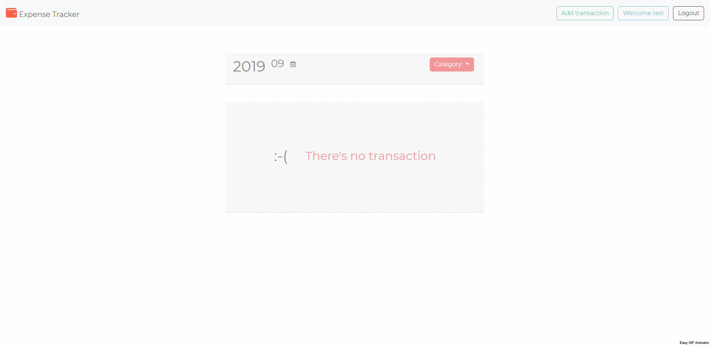

# Expense tracker Sequelize

This is an expense tracker sequelize demo which built up from [Alphacamp](https://tw.alphacamp.co/) semester 3 final exam.



## Feature
1. Show transactions group by date and month.
2. Filter transactions by category.
3. Summarize all the transactions, inflow and outflow.
4. Summarize all the transactions, inflow and outflow with category filter.
5. Register, login and Logout feature with **passport-local** and **passport-facebook**.
6. Validate query string, `req.body`.
7. Build in MySQL server and Sequelize ORM.

## Installing

### 1. Git bash

#### git clone

`git clone` to clone the project.

```markdown
git clone https://github.com/mpragnarok/expense-tracker-sequelize.git
```
### 2. MySQL Server

Install [MySQL Workbench](https://dev.mysql.com/downloads/workbench/) and connect to local server

Create a new database:

```mysql
drop database if exists expenseTracker_sequelize;
create database expenseTracker_sequelize;
```

Use database and show the data in the table:

```mysql
use expenseTracker_sequelize;
select * from records;
select * from users;
```

You can list the data in table with `select * from table-name` after you create the user and todo in the server.

### 3. Environment variable

Go to https://developers.facebook.com/ to create your own **App ID** and **App Secret** for restaurant list App

Create `.env` in the root folder

```js
// .env
FACEBOOK_ID = <Your APP ID>
FACEBOOK_SECRET = <Your App Secret>
CALLBACK_DOMAIN = http://localhost:3000
```

### 4. Command line

#### npm install

Install all the packages in the project.

### 5. configure sequelize

#### config/config.json

```js
{
  "development": {
    "username": "root",
    "password": <YOUR_MYSQL_WORKBENCH_PASSWORD>,
    "database": "todo_sequelize",
    "host": "127.0.0.1",
    "dialect": "mysql"
  },
  "test": {
    "username": "root",
    "password": null,
    "database": "database_test",
    "host": "127.0.0.1",
    "dialect": "mysql"
  },
  "production": {
    "username": "root",
    "password": null,
    "database": "database_production",
    "host": "127.0.0.1",
    "dialect": "mysql"
  }
}
```

#### run the migration

In the powershell, run the migration with follow script:

```powershell
npx sequelize db:migrate
```


### 6. Command line

#### npm run dev

Start the server with **nodemon** command.

#### npm run start

Start the server with node command.

#### CTRL + C twice

Stop running server.

### 7. Browser

Head to [http://localhost:3000](http://localhost:3000) to experience the expense tracker Sequelize demo.

## Description

​	The page has a dynamic index to show up the content of web page which contains front-end and back-end techniques. Front-end part is written in **JavaScript**, **CSS** and **HTML** with **Bootstrap**, back-end part is written in **Node.js** and **Express.js**, server side uses  **MySQL** with **Sequelize**.  

​	The dynamic webpage is made up by **handlebars**. In the home page, it lists all transactions with the order in descending date.

​	Additionally, it has login authentication with local strategy and Facebook strategy which create with **passport.js** , users can only look up the transactions data which they've added.

## packages

#### dependencies with version

1. bcryptjs: 2.4.3
2. body-parser: 1.19.0
3. connect-flash: 0.1.1
5. express: 4.17.1
6. express-handlebars: 3.1.0
7. express-session: 1.16.2
7. express-validator: 6.2.0
8. grunt-cli: 1.3.2
9. method-override: 3.0.0
10. mysql2: 1.7.0
11. passport: 0.4.0
12. passport-facebook: 3.0.0
13. passport-local: 1.0.0
14. sequelize: 5.19.2
15. sequelize-cli: 5.5.1


#### devDependency

1. nodemon: 1.19.1
2. dotenv: 8.1.1


## Future Update
1. Sending emails  when you register, delete user, change password.
2. Complete user route CRUD:
   1. User avatar upload.
   2. User update password and info page.
   3. Delete user.
3. report page to see the graphic report of transactions.

   
